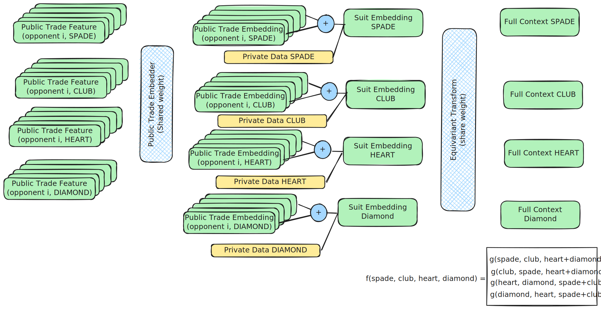
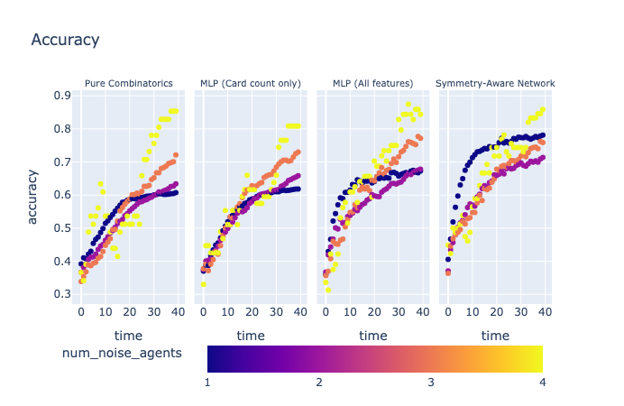

# Section 3: Models Beyond Combinatorics

While the Card-Counter provides a strong statistical floor, it is "market naive."
It assumes transactions occur purely due to deck probability, ignoring the phenomenon of **Adverse Selection**.
If an opponent consistently hits your bid or aggressively lifts an offer, they likely possess information in their favor, to our detriment.
An intelligent agent must treat trades not just as a random distribution of cards, but as a behavioral signal.

## 3.1 Encoding Opponent Aggressiveness

To capture the information hidden in the order flow, we move from pure counting to a supervised neural network. This model is trained to predict the ground-truth deck configuration at the end of each round by observing the "pricing footprint" of other agents.

### Feature Engineering
For each opponent $i$ and suit $s$, we calculate descriptive statistics that capture their strategic intent on the tape:
*   **VWAP (Volume-Weighted Average Price):** The average price at which player $i$ bought or sold suit $s$.
*   **Traded Quantity:** The total volume of player $i$’s activity, distinguishing between liquidity taking and providing.
*   **Inventory Floor:** The physical lower bound $L_{i,s}$ (from Section 2.1).

To maintain architectural simplicity and focus on structural priors, we bypass recurrent modeling (RNNs) in favor of these high-signal snapshots.

## 3.2 Architectures: From MLP to Equivariance

### Phase 1: Feed-Forward Baseline (MLP)
We initially use a standard Multi-Layer Perceptron (MLP). 
While it outperforms the Card-Counter by learning that aggressive pricing correlates with the target suit, it is sample-inefficient. 
It must learn the significance of a "Hearts" price and a "Spades" price separately, despite them being functionally identical under the game's rules.

### Phase 2: Symmetry-Aware (Equivariant) Networks
To accelerate generalization, we "hardcode" the game’s physical symmetries directly into the network architecture:

1.  **Agent Invariance (Deep Sets):** We process each opponent's data through a shared encoder. 
A permutation-invariant pooling layer (summation) aggregates these into a "Suit Embedding Context," ensuring the model reacts to *behavioral patterns* regardless of which seat the agent occupies.
2.  **Intra-Color Equivariance:** The model treats permutations within a color group (e.g., Spades $\leftrightarrow$ Clubs) as symmetric, ensuring a lesson learned in one black suit applies to the other.
3.  **Inter-Color Equivariance:** The model recognizes that swapping all Red suits with all Black suits results in an identical strategic game state.

This approach effectively **4x-es our training data density**, as the network learns the "concept" of a suit rather than specific labels.

## 3.3 Ablation Study Results

We evaluated the **Target Suit Prediction Accuracy** at each tick of the game (40 ticks per game). 
The models were tested in a 5-agent simulation with varying ratios of Informed (Card-Counters) vs. Noise agents.

**Target Accuracy (%) Comparison**
| Scenario (Opponents) | Pure Combinatorics | MLP (Count Only) | MLP (All Features) | Symmetry-Aware (All) |
|:--- |:---:|:---:|:---:|:---:|
| 1 Noise vs 4 Card-Counters | 0.5445 | 0.5475 | 0.6158 | **0.7081** |
| 2 Noise vs 3 Card-Counters | 0.5235 | 0.5482 | 0.5756 | **0.6156** |
| 3 Noise vs 2 Card-Counters | 0.5456 | 0.5810 | 0.6112 | **0.6220** |
| 4 Noise vs 1 Card-Counter | 0.6014 | 0.5900 | 0.6509 | **0.6670** |

> **Key Observation:** The Symmetry-Aware Network consistently provides the highest uplift, particularly when the market contains more informed players. 
This suggests the model is successfully "piggybacking" on the information discovery performed by other intelligent agents.

## 3.4 Information Leakage & Convergent Dynamics

By plotting prediction accuracy over time, we see how the presence of informed players drives "Price Discovery."
In environments with 4 informed card-counters, the Symmetry-Aware model identifies the target suit significantly faster than all other baselines. 

Conversely, when the market is dominated by noise (4 noise agents), the performance of all supervised models converges, as there is no coherent "behavioral signal" to decode from the tape.

